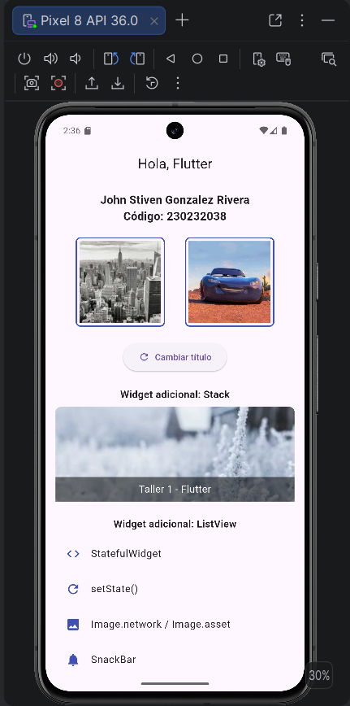
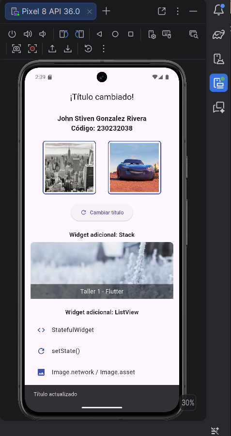

# Taller 1 - Flutter: StatefulWidget y setState()

**Asignatura:** Electiva Profesional I
**Estudiante:** John Stiven Gonzalez Rivera
**Código:** 230232038
**Rama del taller:** `feature/taller1`

## Descripción

Este taller consiste en construir una pantalla básica en Flutter (`HomePage`) usando
un `StatefulWidget`, evidenciando el uso de `setState()` para actualizar la interfaz
de forma dinámica. La pantalla incluye:

- Un `AppBar` cuyo título cambia entre "Hola, Flutter" y "¡Título cambiado!" al
  presionar un botón, usando `setState()`.
- Un `SnackBar` que se muestra al presionar el botón, con el mensaje
  "Título actualizado".
- Un `Text` centrado con el nombre completo del estudiante.
- Un `Row` con dos imágenes: una cargada con `Image.network()` y otra con
  `Image.asset()`.
- Dos widgets adicionales: un `Stack` (texto superpuesto sobre una imagen) y un
  `ListView` (lista de 4 elementos con ícono y texto).
- Organización visual con `Column`, `Padding`, `SizedBox` y alineaciones.

Adicionalmente, el flujo de trabajo del proyecto sigue buenas prácticas de control
de versiones: un único repositorio con ramas `main` (estable), `dev` (desarrollo)
y `feature/taller1` (rama específica de este taller, creada desde `dev`), integrado
mediante Pull Requests.

## Estructura del proyecto

```
lib/
  main.dart          # Código principal de la app (HomePage, StatefulWidget)
assets/
  images/
    foto.png         # Imagen local usada con Image.asset()
```

## Requisitos previos

- [Flutter SDK](https://docs.flutter.dev/get-started/install) instalado y
  configurado (`flutter doctor` sin errores críticos).
- Android Studio con un emulador configurado (o un dispositivo físico conectado).

## Pasos para ejecutar el proyecto

1. Clonar el repositorio:

   ```bash
   git clone https://github.com/johngonzalez02/flutter-taller1.git
   cd flutter-taller1
   ```

2. Instalar las dependencias del proyecto:

   ```bash
   flutter pub get
   ```

3. Verificar que haya un emulador Android abierto (o un dispositivo conectado):

   ```bash
   flutter devices
   ```

4. Ejecutar la aplicación:

   ```bash
   flutter run
   ```

5. Una vez la app esté corriendo, presiona el botón **"Cambiar título"** para ver
   el cambio de título en el `AppBar` (evidenciando `setState()`) y el `SnackBar`
   con el mensaje "Título actualizado".

## Capturas de pantalla

### Estado inicial de la aplicación


### Título cambiado + SnackBar (tras presionar el botón)

En esta misma captura también se evidencian los dos widgets adicionales
implementados (`Stack` y `ListView`), visibles en la parte inferior de la pantalla.



## Flujo de trabajo con Git

1. Repositorio único y público en GitHub.
2. Rama `feature/taller1` creada desde `dev`.
3. Desarrollo del taller y commits realizados en `feature/taller1`.
4. Pull Request de `feature/taller1` → `dev`, revisado e integrado.
5. Pull Request de `dev` → `main`, revisado e integrado.

## Explicación de StatefulWidget y setState()

`HomePage` extiende de `StatefulWidget` porque necesita mantener un estado interno
(el texto del título del `AppBar`) que puede cambiar durante el ciclo de vida del
widget. La clase asociada `_HomePageState` (que extiende `State<HomePage>`)
almacena la variable `_appBarTitle`.

Cuando el usuario presiona el `ElevatedButton`, se ejecuta el método
`_cambiarTitulo()`, el cual llama a `setState()` para modificar la variable
`_appBarTitle`. Esta llamada le indica a Flutter que el estado del widget cambió,
por lo que debe reconstruir (`rebuild`) la interfaz para reflejar el nuevo valor
en el `AppBar`. Sin `setState()`, el cambio de la variable no se vería reflejado
visualmente en pantalla, ya que Flutter no sabría que debe redibujar el widget.

Adicionalmente, tras el cambio de estado se muestra un `SnackBar` mediante
`ScaffoldMessenger.of(context).showSnackBar()`, confirmando visualmente al
usuario que la acción se ejecutó correctamente.